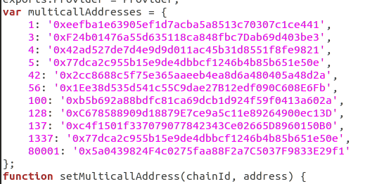

# ethcall

Utility library to make calls to Ethereum blockchain.

Based on MakerDAO's [Multicall contract](https://github.com/makerdao/multicall) to make multiple requests in a single HTTP query. Encodes and decodes data automatically.

Inspired and powered by [ethers.js](https://github.com/ethers-io/ethers.js/).

Heco multicall address is from [Heco Verified Contract repository](https://hecoscan.xyz/contractsVerified?cn=multicall&filter=)


```
$ npm install
$ tsc example_hec_pairs.ts
$ node example_hec_pairs.js
```

# Attention:
Since the original ethers-multicall does not support Heco chain, so the additional multicall contract address on Hco must be added in to provider.ts. The Chian_id of Heco mainnet is 128. 

Like this:



## API

* `Contract(address, abi)`: create contract instance; calling `contract.call_func_name` will yield a `call` object.
* `all(calls)`: execute all calls in a single request.
* `calls`: list of helper call methods
* `getEthBalance(address)`: returns account ether balance

## Example

```js
import { Contract, Provider } from 'ethcall';
import { InfuraProvider } from '@ethersproject/providers';

import erc20Abi from './abi/erc20.json';

const infuraKey = 'INSERT_YOUR_KEY_HERE';
const provider = new InfuraProvider('mainnet', infuraKey);

const daiAddress = '0x6b175474e89094c44da98b954eedeac495271d0f';

async function call() {
	const ethcallProvider = new Provider();
	await ethcallProvider.init(provider);

	const daiContract = new Contract(daiAddress, erc20Abi);

	const uniswapDaiPool = '0x2a1530c4c41db0b0b2bb646cb5eb1a67b7158667';

	const ethBalanceCall = ethcallProvider.getEthBalance(uniswapDaiPool);
	const daiBalanceCall = daiContract.balanceOf(uniswapDaiPool);

	const data = await ethcallProvider.all([ethBalanceCall, daiBalanceCall]);

	const ethBalance = data[0];
	const daiBalance = data[1];

	console.log('eth balance', ethBalance.toString());
	console.log('dai balance', daiBalance.toString());
}

call();

```

